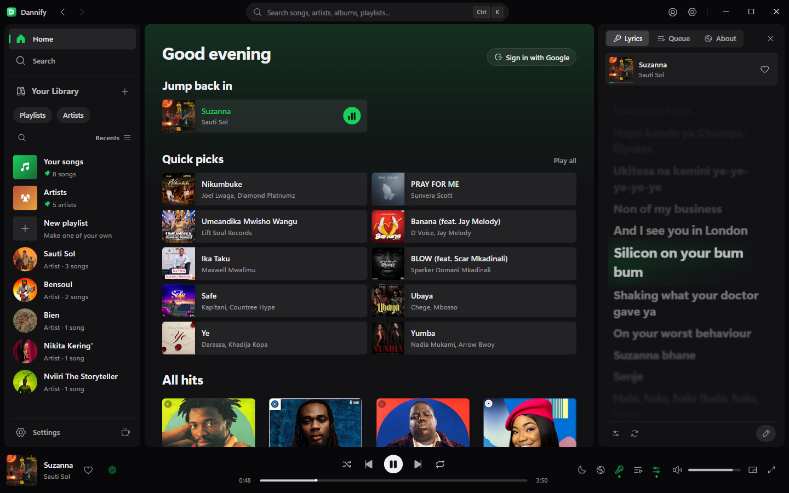
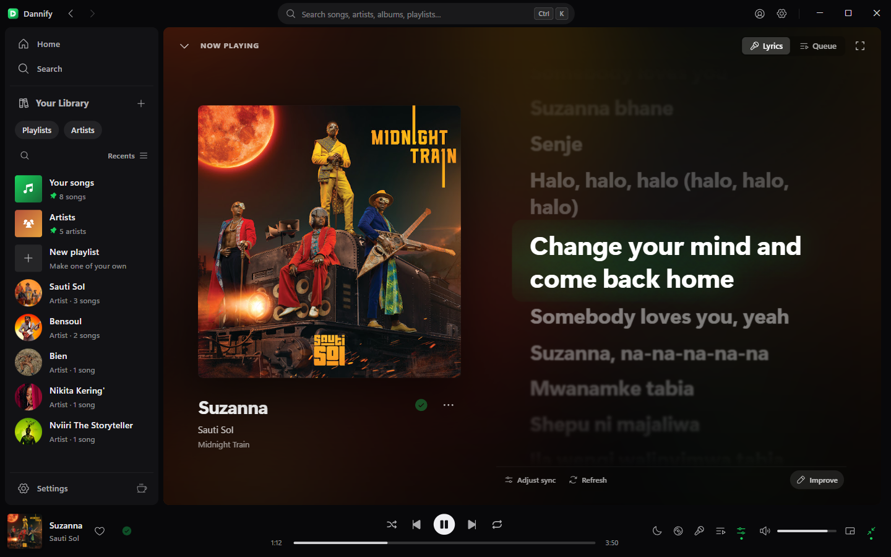
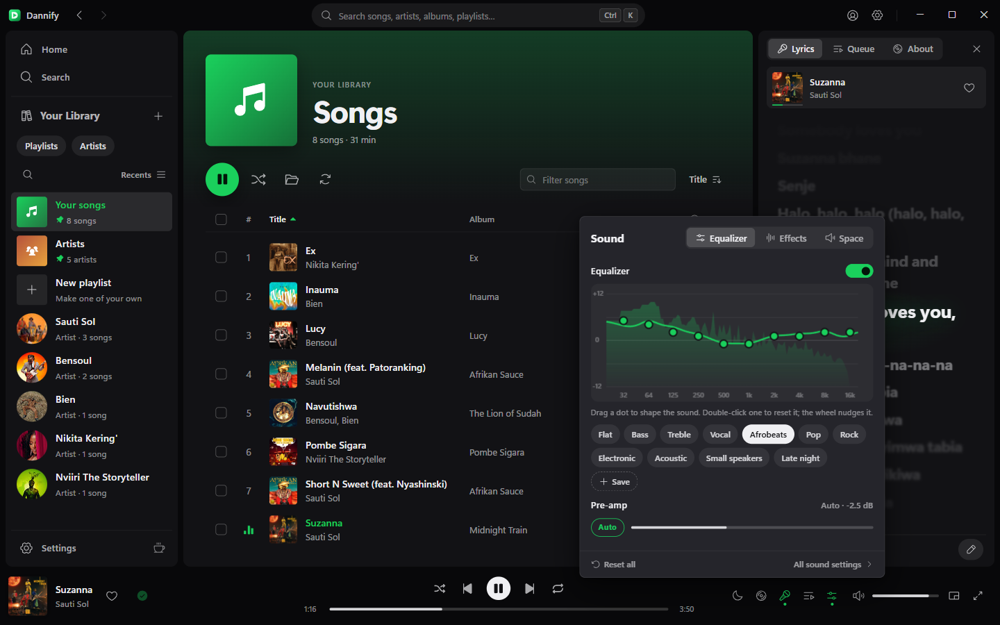
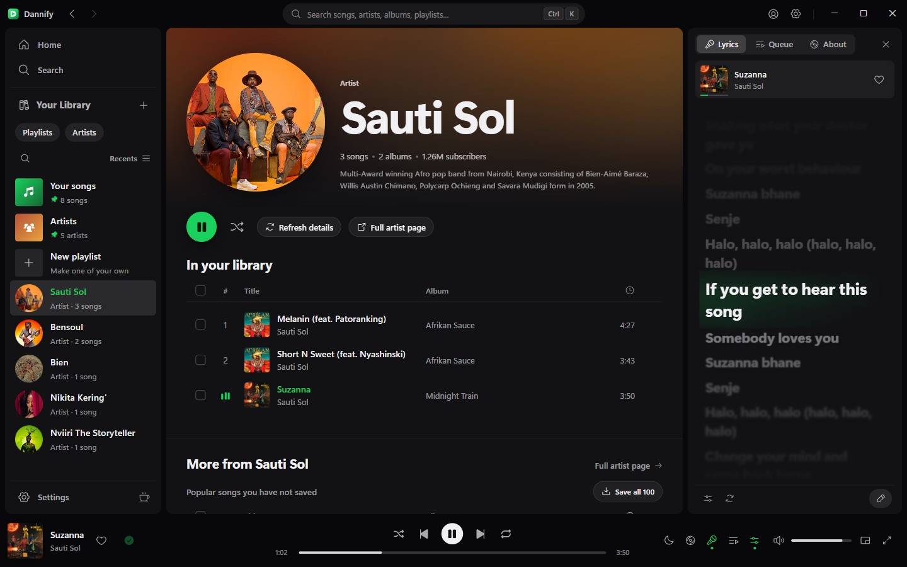
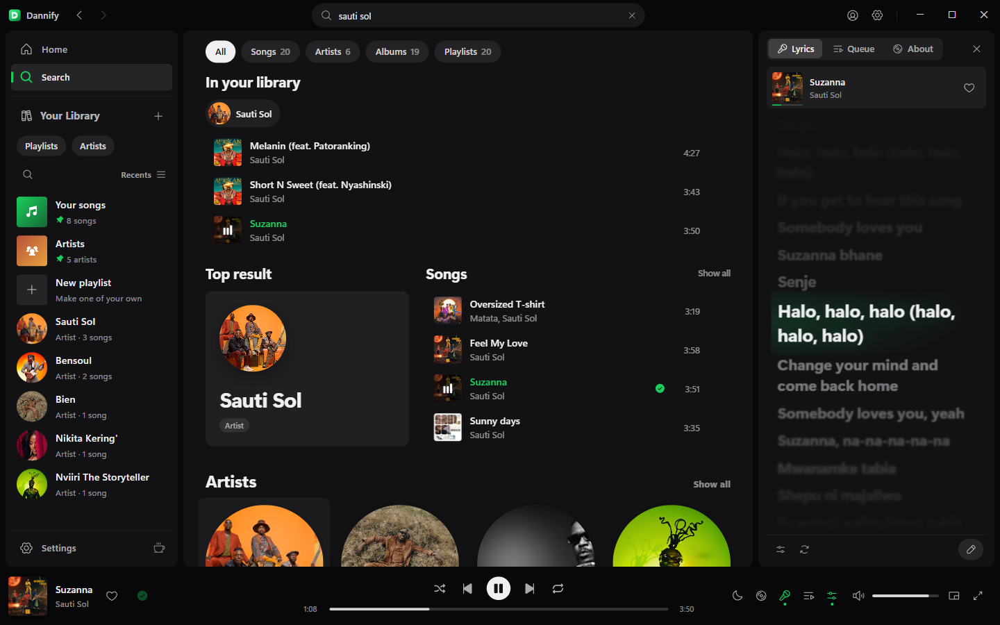
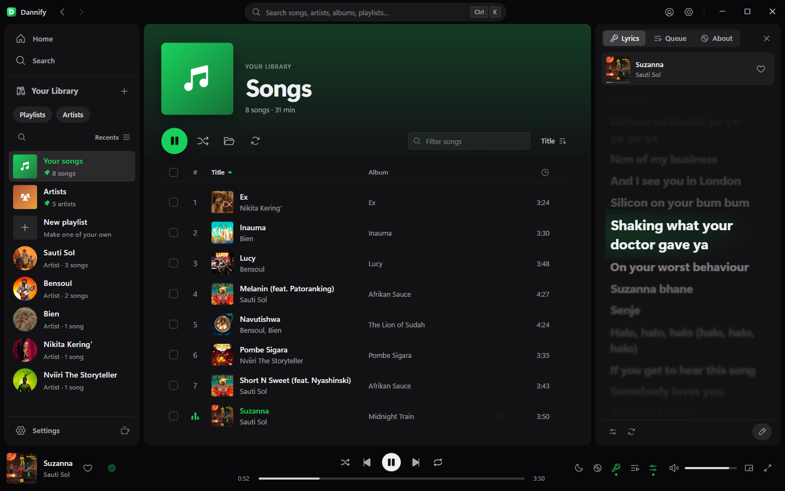
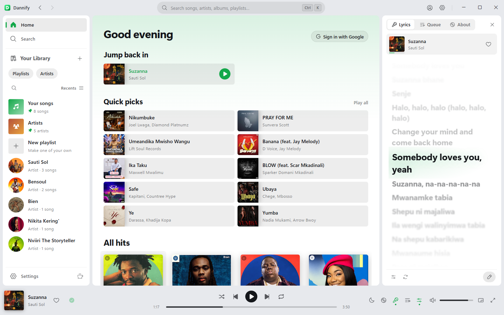

# Dannify

A music player for Windows, Linux and macOS. Search for anything, play it
straight away, and keep the tracks you want as real files with artwork, tags
and synced lyrics.

I built it because every other option was either a browser tab pretending to
be an app, or a downloader with no player attached. This is one program: a
native window, a tray icon, media keys, and a backend on loopback that nothing
outside the app can reach.



| | |
| --- | --- |
|  |  |
|  |  |
|  |  |

## What it does

Search the YouTube Music catalogue and play anything in about a third of a
second. Results come in as you type.

Download whatever you want to keep. MP3, FLAC, OGG, Opus or M4A, tagged
properly, with cover art embedded and an `.lrc` beside it.

Lyrics scroll in a side panel and follow the song. If a track has none, there
is an editor for writing them and tapping the timing in, and what you write
goes out to everyone else playing that song.

Sign in with Google and you get your own home feed, liked songs and playlists.

It picks up where you left off. Close it and the queue and the track you were
on come back next launch, paused at the second you stopped.

Closing the window keeps the music going. It drops to the tray instead of
quitting.

## Install

Everything is on the [downloads
page](https://github.com/DANIELMWENDWA9451/Dannify/releases):

- **Windows 10 and 11:** `Dannify-Setup-<version>.exe`.
- **Ubuntu, Debian, Mint and the like:** `linux-dannify_<version>_amd64.deb`,
  installed with `sudo apt install ./linux-dannify_<version>_amd64.deb`
  (see [packaging/linux](packaging/linux/README-UBUNTU.md)).
- **macOS:** `macos-Dannify-<version>-arm64.dmg` for Apple silicon, `-x64` for
  Intel Macs. The app is not notarized by Apple, so the first time, right-click
  it and choose Open (see [packaging/macos](packaging/macos/README.md)).

Every copy updates itself from signed releases.

## Building it

You need Python 3.14, Node 20 or newer, and the .NET SDK (8 or newer) for
the installer.

```powershell
cd Backend
python -m venv venv
.\venv\Scripts\pip install -r requirements.txt
cd ..\frontend
npm install
cd ..
pwsh packaging\build.ps1
```

That runs the backend and interface tests, then leaves you
`Backend\dist\Dannify\`, the installer `packaging\out\Dannify-Setup-<version>.exe`,
and the update package (`package-<version>.json` and `.zip`) beside it, all
signed (see [Signed releases](#signed-releases)). Building the installer needs
the release key; `-SkipInstaller` builds the app folder without it.

Two binaries are not in the repo because they are redistributables, not
source: the media encoder at `packaging\media\dnfmedia.exe` and the JS engine
at `packaging\jsruntime\dnfjs.exe`. Notes in `packaging\config\README.md`.

## Working on it

```powershell
cd Backend
.\venv\Scripts\python.exe desktop.py
```

Environment variables worth knowing:

| Variable | What it does |
| --- | --- |
| `DANNIFY_INSTANCE` | Suffixes the single-instance lock so a second copy can run |
| `DANNIFY_DATA_DIR` | Settings, caches and the WebView profile |
| `DANNIFY_DEVTOOLS_PORT` | Remote debugging port. Source builds only |
| `DANNIFY_LOG_LEVEL` | `debug` when something is wrong |
| `DANNIFY_UPDATE_REPO` | Check a different `owner/name` for updates |
| `DANNIFY_UPDATE_API` | A stand-in release server, for testing updates. `127.0.0.1` only |
| `DANNIFY_KEY` | The key for `main.py` run on the network (`--host 0.0.0.0`). One is made up and printed if unset |

A second copy needs its own `DANNIFY_DATA_DIR`. WebView2 will not open the
same profile folder twice with different options, and you get a dead window
instead of a useful error.

## A note on how it plays

Streams resolve by talking to YouTube's app clients directly rather than going
through a general-purpose extractor. Those clients hand back a plain URL, so
there is no player script to download and no JavaScript challenge to solve.
Roughly 350 ms instead of fifteen seconds. yt-dlp is still there as a fallback
for the tracks those clients refuse.

The client identity strings are what make this work, and Google rotates them
every few months. They live in `Backend/dannify/clients.json` so a rotation is
a config fix, not a rebuild.

## Installing and updating

`installer/` is one small .NET Framework program that is the installer, the
launcher and the uninstaller. The setup is that program with the app packed
on the end. An install looks like this:

```
%LOCALAPPDATA%\Programs\Dannify\
  Dannify.exe     the launcher; shortcuts and the Apps entry point here
  app\            the app itself
```

The running app gets an update ready in `app-next\` in the background,
fetching only the files that changed out of `package-<version>.zip`. The
launcher swaps the folders the next time Dannify starts, or straight away on
Restart to update, and keeps the previous version. If the new one cannot
start, it goes back to the old one and skips that version.

`python packaging\lifecycle.py` runs install, launch, update, restart,
rollback and uninstall end to end in a sandbox that touches no real install,
registry entry or library. `upgrade`, `restart_previous`,
`setup_over_previous` and `rollback_previous` do the same starting from the
release before this one, the way people who already have Dannify will get the
new version, and `migrate` does it from a 3.x folder.

## Releases

The version lives in `Backend/dannify/__init__.py`; the build stamps it
everywhere else. Bump it, build, then publish:

```powershell
pwsh packaging\publish.ps1 -Notes "what changed"
```

Pushing the tag starts the release workflow, which builds the Linux `.deb`
and the macOS apps on GitHub's machines. `publish.ps1` waits for it, downloads
those builds, signs them here with the offline release key (it never goes
near GitHub), checks every file against the key installed copies trust, and
uploads everything as one release. Each platform takes only its own files
from it; installed copies update from the latest release.

### Signed releases

From 4.7.0 every installed copy refuses an update that is not signed with
Dannify's release key. A SHA-256 only shows a download was not damaged; it
comes from the same release as the files, so it cannot show who made them.
The signature (Ed25519, `Backend/dannify/signing.py`) covers the package list,
which names every file's hash, the installer, the Linux package and the macOS
app. What is signed names the kind of file, its platform and processor, so a
signature can never be passed off for another platform's file.
`build.ps1` signs the Windows files and `publish.ps1` the others; both check
them against the public key in `updates.py` before anything can be
published.

```powershell
python packaging\release_key.py new      # once, ever: prints the PUBLIC_KEY line
python packaging\release_key.py public   # what updates.py must carry
```

The private key lives in `%USERPROFILE%\.dannify\release-signing.key`, or in
`DANNIFY_RELEASE_KEY`, on the release machine only: never in the repository and
never in a CI secret. **Back it up offline.** If you lose it, installed copies
can only be moved to a new key
by installing by hand. If it leaks, anyone can sign an update.

Windows code signing is separate and optional: set `DANNIFY_SIGN_THUMBPRINT`
to a code-signing certificate in `CurrentUser\My` and `build.ps1` signs the
setup, so SmartScreen stops warning. The installer reads its payload past an
Authenticode signature, and `pwsh packaging\test_installer.ps1` checks that,
signed and unsigned, on every CI run.

## Licence

MIT: see [LICENSE](LICENSE). Components made by others keep their own
licences, listed in [THIRD-PARTY-NOTICES.md](THIRD-PARTY-NOTICES.md).

---

Daniel Mwendwa
